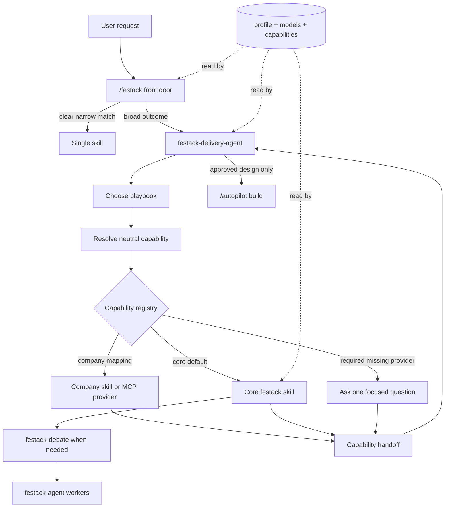

# festack

A vendor-neutral workflow stack for Solution Architects and Field Engineers.

festack points the same machinery a strong engineering stack uses (multi-model debate, Socratic decision gates, setup, personalize, retro, continual learning) at the SA engagement lifecycle. The unit of work is a client deliverable, not a code diff.

## How festack works



Start with `/festack`. It routes narrow asks to one skill, or sends broad outcome work to `festack-delivery-agent`, which chooses a playbook and resolves each neutral capability to either a core festack skill or a configured company provider.

## Principles

- **Composable.** Nothing is a mandatory gateway. Any skill is an entry point. Bigger skills compose smaller ones.
- **Lazy front door.** `/festack` is the default user experience: describe the situation once, then let the router pick one skill or the delivery agent.
- **Smart next steps.** Skills should suggest the next useful move when it is obvious, but should not force a workflow just because one exists.
- **System 2 where it counts.** Skills resolve observable facts themselves, choose reversible defaults, and reserve `AskQuestion` for genuine scope, audience, success, risk, and approval decisions.
- **Multi-model where it pays.** Applied where work iterates heavily under human review (deliverable review, diagrams, research, demos, contested alignment). Enterprise token cost is acceptable for high-value artifacts, but panels are not forced into low-stakes steps. On single-provider hosts the same panels stay diverse through per-worker lenses.
- **Canvas-first when structure matters.** FE work often needs a shared visual surface, so complex understanding, review findings, diagrams, and multi-part deliverables should use canvas when it makes the work easier to inspect.
- **Human-in-the-loop gates.** `AskQuestion` is a differentiator, not friction: use it for genuine scope, audience, success criteria, risk, and build-approval decisions so the FE stays involved instead of delegating everything to pure AI.
- **Vendor-neutral.** Company specifics arrive through one profile file. The core skills ship with no company or product defaults. Your platform, sources, and differentiators are a filled-in profile.

## Command palette

Start at `/festack` if you are not sure which skill you need. Narrow asks route to one skill. Broad FE asks hand off to `festack-delivery-agent`, which carries the work through the right playbook end to end.

Use direct skills only when you already know the deliverable or decision you want. Setup is once-per-environment with `/setup-festack`. Build only after design approval via `/autopilot`.

### Front door and setup

| Command | Role |
| --- | --- |
| `/festack` | The canonical front door. Classifies your intent, fixes setup gaps, and either routes to one skill or hands broad work to `festack-delivery-agent`. |
| `/setup-festack` | Recommended one-command setup and repair flow. Coordinates profile, model roles, and capability wiring. |
| `/personalize` | Focused profile update: role, platform, sources, audience, delivery defaults, writing voice. |
| `/setup-models` | Focused model-role config written to the host's model config (`festack-models.mdc` on Cursor, `~/.claude/festack/models.md` on Claude Code). |
| `/setup-capabilities` | Focused capability-provider wiring so company packs can satisfy neutral workflow slots. |

### Engine and reasoning primitives

| Command | Role |
| --- | --- |
| `festack-debate` | Internal engine. Fan out runners and synthesize, or fan out reviewers and critique. Invoked by other festack skills, not typed as a command. |
| `/fe-deslop` | The anti-slop prose standard. Composed by every skill that writes prose; usable directly to clean up a draft. |
| `/problem-frame` | Understand and structure a fuzzy client problem. Pain, constraints, stakeholders, unknowns, and canvas. |
| `/solution-critic` | Decide between approaches and get a recommendation. Multi-model design debate with decision gates. |
| `/review-work` | Cross-review or red-team a draft against a rubric toward client-ready. |

### Engagement lifecycle

| Command | Role |
| --- | --- |
| `/scope-and-align` | Socratic alignment of vision, goal, requirements, success criteria, audience, risks, and the winning deliverable. Outputs a written brief and a canvas. |
| `/discovery` | Build a structured picture of a client from profile-declared sources, with citations and confidence. |
| `/demo` | Design a customer demo with multi-model debate, decision gates, and canvas understanding before any build. |
| `/diagram` | Produce a client-ready diagram with multi-model iteration and a visual feedback loop. Tool-agnostic. |
| `/doc` | Produce a client-ready document with the right structure and humanized prose. |
| `/poc` | Scope a proof of concept as a living contract with measurable exit criteria. |
| `/compete` | Position against a competitor, fairly and with proof. Fast answer or competitive research for packaged assets. |
| `/client-debug` | Answer an ad-hoc client or product question systematically, with citations and explicit confidence. |
| `/autopilot` | Execute an approved scope autonomously, phase by phase, pausing only at genuine decision gates. |
| `/handoff` | Package an engagement's ledger into one self-contained snapshot a colleague can pick up cold. |

### Agents

| Agent | Role |
| --- | --- |
| `festack-delivery-agent` | End-to-end FE orchestrator behind `/festack`. Chooses playbooks, sequences skills, keeps state visible, asks gates, and hands approved builds to `/autopilot`. |
| `festack-agent` | Stateless worker for `festack-debate`, review panels, focused research, and evaluator jobs. It receives a self-contained prompt from a parent skill and returns structured output. |

### Learning

| Command | Role |
| --- | --- |
| `/retro` | Reflect on an engagement and pull out durable lessons. |
| `/learn` | Turn observations and feedback into profile updates and accumulated lessons, deduped. |

## Simple setup

1. Install the plugin.
2. Reload the host.
3. Run `/setup-festack`.

`/setup-festack` writes the profile, model roles, and capability wiring when useful. If no company-specific providers are installed yet, core defaults are enough to start.

The workflow canvas ships with the repo at `canvases/festack-workflow.canvas.tsx`. Cursor users can open the live canvas beside chat; other hosts use the same content as a static workflow map.

## Configuration model

festack reads configuration from a host-specific config root. Set `FESTACK_HOME` to override it.

| Host | Config root | Model-role config |
| --- | --- | --- |
| Cursor | `~/.cursor/festack` | `~/.cursor/rules/festack-models.mdc` |
| Claude Code | `~/.claude/festack` | `~/.claude/festack/models.md` |
| Codex | `~/.codex/festack` | `AGENTS.md` / `config.toml` |

- **Profile.** `$FESTACK_HOME/profile.md`, read on demand. Holds role, company, platform, sources, audience, delivery defaults, and voice. Written by `/personalize`.
- **Capabilities.** `$FESTACK_HOME/capabilities.md` by default. `$FESTACK_HOME/capabilities.yaml` is available for strict parsing. Maps neutral capabilities such as `research.account` or `create.client_doc` to installed providers. Written by `/setup-capabilities`.
- **Lessons.** `$FESTACK_HOME/lessons.md`, read on demand. Written by `/learn`.
- **Models.** Read from the host's model-role config above. Written by `/setup-models`.

Skills reference roles, never hardcode model slugs, and carry an inline fallback only when a role line is absent.

`/setup-festack` is the normal setup path. The focused setup skills remain available when you only want to refresh one part.

## Engagement ledger (v2)

festack keeps per-engagement state under `$FESTACK_HOME/engagements/`: a one-page
`brief.md` of curated facts and an append-only `log.md` of receipts. Engagements
auto-create on first touch of a named account, go dormant automatically after 30 quiet
days, and archive through `/retro` when you declare an outcome. Resume always announces
which engagement it picked. `/handoff <engagement>` packages the ledger into one
snapshot you can paste to a colleague. Rules live in
`skills/festack/references/ledger-lifecycle.md`.

A last-look hook watches outward-facing sends (mail, Drive, Slack) made through agent
tools: it never blocks, prints one awareness line when an artifact ships unreviewed,
and appends an outbound receipt to the ledger. It acts only on positive evidence that
a send is external (outside-org recipient, shared/external channel); when it cannot
tell, it stays silent and writes nothing - internal traffic never generates noise.
Sends made outside agent tools are invisible to it by design; it is an
audit-and-awareness layer, not a guarantee. Claude Code wires it via the plugin's
`hooks/hooks.json`; Cursor users merge `hooks/cursor-hooks.json` into
`~/.cursor/hooks.json` (`scripts/install.sh cursor` places the hook script at
`~/.cursor/festack/hooks/`). On both hosts, export `FESTACK_ORG_DOMAIN` (for example
`databricks.com`) in the hook's environment: gmail externality detection needs it to
tell external recipients from internal ones, and stays silent without it.

## Company packs and MCP providers

Profile names sources. Capabilities make them callable.

Company-specific plugin packs should not change core playbooks for normal provider substitution. They should register providers for neutral capabilities, for example `fetch.customer_usage` or `create.diagram`, through the capability registry.

Capability registry v1 is an instruction-level workflow contract, not executable code. It makes provider choice explicit and reviewable, but agents still verify that each required capability ran and produced a handoff.

Providers can be core festack skills, company plugin skills, or MCP providers.

Recommended MCP naming convention:

- `mcp:<server>` when the provider is a tool family selected at runtime.
- `mcp:<server>/<tool>` when one MCP tool owns the capability.

Example:

```yaml
capabilities:
  research.account:
    preferred:
      - provider: /discovery
        type: core-skill
        when: default account research
      - provider: mcp:user-glean/search
        type: mcp-tool
        when: internal docs are needed
      - provider: salesforce-actions
        type: company-skill
        when: CRM fields are needed
    fallback: /discovery

  fetch.customer_usage:
    preferred:
      - provider: mcp:user-databricks/execute_parameterized_sql
        type: mcp-tool
        when: governed usage data is available
    fallback: ask
```

Transferability examples:

- **Databricks field team.** Map `research.account` to CRM and internal search, `fetch.customer_usage` to usage telemetry, `research.product_question` to product docs and internal knowledge, and `build.approved_scope` to demo/app/bundle deployment adapters.
- **Cursor AI field team.** Map `research.product_question` to product/admin/security docs, `decide.approach` to developer workflow rollout decisions, and `build.approved_scope` to demo or sandbox builders.
- **OpenAI field team.** Map `research.product_question` to product/security/governance sources, `decide.approach` to RAG or agent architecture decisions, and `build.approved_scope` to approved app, eval, or deployment adapters.

Starter registries live in `samples/capabilities-databricks.yaml`, `samples/capabilities-cursor-ai.yaml`, and `samples/capabilities-openai.yaml`. Copy the closest one into `$FESTACK_HOME/capabilities.md` or `$FESTACK_HOME/capabilities.yaml`, then adjust provider names to match the installed skills and MCP servers in your host.

To add a truly new company workflow, extend the neutral references deliberately: add the capability to `capability-taxonomy.md`, map core fallback behavior in `default-capability-registry.md`, and add or extend a playbook in `playbooks.md`. Do not hide new workflow semantics inside a company provider name.

## Install

Prerequisites: `git`, `bash`, and the target host installed. Use `--copy` instead of symlinks in locked-down environments.

festack is a standard plugin for both hosts: a `.cursor-plugin/plugin.json` and a `.claude-plugin/plugin.json` manifest over the same `skills/` and `agents/`. One installer wires it into whichever host you use.

### Cursor (recommended)

```bash
git clone https://github.com/casper7995/festack.git
cd festack
scripts/install.sh cursor
```

This symlinks every skill (including `/festack`) and every festack agent into `~/.cursor/skills` and `~/.cursor/agents`. That path always loads in Cursor today. It also links the plugin manifest to `~/.cursor/plugins/local/festack` for when local plugins are enabled (`userLocal=true` in plugin logs).

Then reload the window (`Developer: Reload Window`) and type `/festack` in chat.

Plugin-only install (only if you rely on local plugin loading):

```bash
scripts/install.sh cursor --plugin-only
```

Add `--copy` on any host to copy instead of symlink.

### Claude Code

festack ships a Claude Code plugin manifest (`.claude-plugin/plugin.json`) and a
single-plugin marketplace (`.claude-plugin/marketplace.json`). Install it as a plugin:

```
/plugin marketplace add https://github.com/casper7995/festack.git
/plugin install festack@festack
```

Skills load namespaced (`festack:festack`, `festack:demo`, ...) and the
`festack:festack-agent` worker resolves exactly as `festack-debate` addresses it.
Update with `git pull` in the repo followed by `/plugin update festack`.

Whichever install path you use, run `/setup-models` once; on Claude Code it writes
`~/.claude/festack/models.md` with the defaults: `opus` panel workers, `fable` synthesizer,
`haiku` evaluator/classifier.

Fallback for environments where plugins are restricted:

```bash
scripts/install.sh claude --copy
```

## Verify

Run the contract tests and install checks before shipping changes:

```bash
scripts/test.sh
bash -n scripts/install.sh
bash -n scripts/verify-install.sh
scripts/install.sh cursor
scripts/verify-install.sh
```

## Portability: Claude Code and Codex

Skills are portable as-is. All three hosts use the same `<name>/SKILL.md` format, so the same `skills/` and `agents/` directories install everywhere:

```bash
scripts/install.sh claude   # links into ~/.claude/skills + ~/.claude/agents
scripts/install.sh codex    # links into ~/.codex/skills + ~/.codex/agents
```

On Claude Code, prefer the plugin install in the Install section above; the script is the fallback.

What differs per host is a thin tool/config layer. The tweaks:

| Concern | Cursor | Claude Code | Codex |
| --- | --- | --- | --- |
| Plugin manifest | `.cursor-plugin/plugin.json` | `.claude-plugin/plugin.json` (shipped) | drop `skills/` into `~/.codex/skills` |
| Decision-gate UI | `AskQuestion` | `AskUserQuestion` | host prompt |
| Visual artifact | `canvas` / `docs-canvas` | no canvas tool: skills fall back to a written Markdown/HTML artifact | same fallback |
| Subagents | `Task` (Cursor model slugs) | `Task` (Claude aliases: `fable`, `opus`, `haiku`) | subagents (Codex models) |
| Model config file | `~/.cursor/rules/festack-models.mdc` (`alwaysApply`) | `~/.claude/festack/models.md` | `AGENTS.md` / `config.toml` |
| `disable-model-invocation` | honored | ignored harmlessly | ignored harmlessly |

Design choices that make the move cheap:

- **`/setup-festack` gives users one setup command** while keeping profile, model, and capability files separate underneath.
- **`/setup-models` detects available models in-session** and writes the mapping to the host's model-role config. Profile, capability, and lesson files also live under the host's festack config root.
- **`/festack` can hand broad work to `festack:festack-delivery-agent` and fall back to an installed or general-purpose subagent** when the namespace does not resolve, so the playbook layer still works across hosts.
- **`festack-delivery-agent` selects a playbook, resolves capabilities, then invokes providers** so company-specific skills plug into predefined workflows without being hardcoded in the orchestrator.
- **`festack-debate` addresses its worker as `festack:festack-agent` and falls back to a `generalPurpose` subagent** when that namespace does not resolve, so debate and critique still run on hosts where the plugin agent namespace differs.

The canvas fallback is the one real degradation: on hosts without a canvas tool, deliverables render as a Markdown or HTML file instead of an interactive canvas. The reasoning, gates, and multi-model loop are identical.
